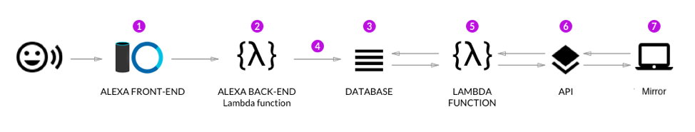

## Table of Contents

1. [ Quick Start ](#QuickStart)
2. [ Architecture Diagram ](#ArchitectureDiagram)

---

<a name="QuickStart"></a>
## Quick Start
We used the Alexa Skills Kit Command Line Interface (ASK CLI) to manage the Alexa skills and related resources, such as AWS Lambda functions. The following commands provide basic functionality for managing skills within a terminal at the parent directory.
```bash
# Install ASK CLI
npm install -g ask-cli

# Deploy the skill to the developer account
ask deploy

# Clone the skill from the development stage to the local directory
ask clone -s amzn1.ask.skill.49176bf2-0d6e-48fd-a55f-eefe415e6b4d
```
For more information, please refer to
https://developer.amazon.com/docs/smapi/quick-start-alexa-skills-kit-command-line-interface.html

---
<a name="ArchitectureDiagram"></a>
## Architecture Diagram


1. Build the Alexa Interaction Model (the front-end).
2. Build the back-end functionality using a Node.js Lambda function. Point the front-end to the back-end.
3. Set up a database that will store information the user speaks to Alexa.
4. Connect the back-end lambda function to the database so that the command the user speaks to Alexa is stored in the database.
5. Create a lambda function that reads from the database.
6. Set up an API that will access the lambda function and return the value of the function retrieved from the database.
7. This mirror will access the API to determine which information to show. Every time the user asks for new information, the mirror will be updated.
